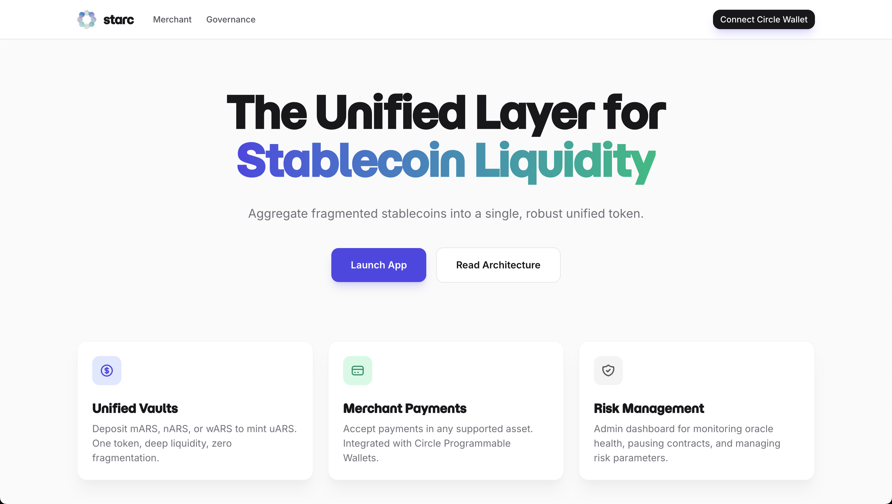
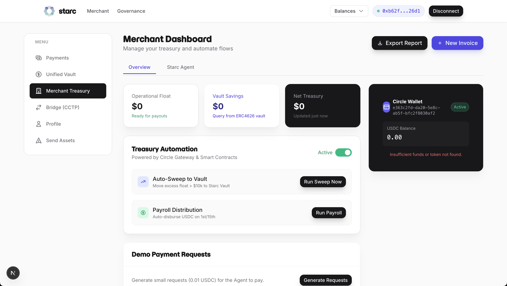
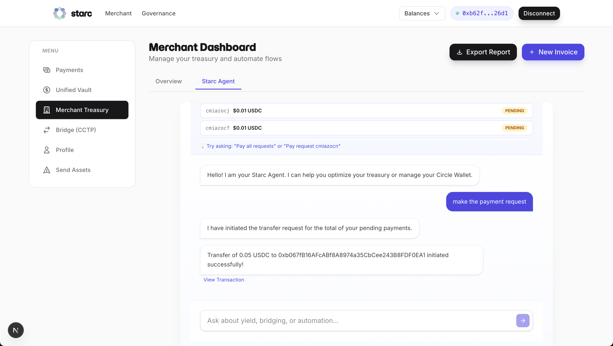

# Starc Protocol

Unified stablecoin payment settlement layer on the Arc Network.



## Overview

Starc enables merchants to accept USDC payments through Circle Programmable Wallets, settling them into an ERC4626 vault on Arc Testnet. The system provides payment link generation, transaction tracking, and basic treasury automation.

**Core Files:**
- Frontend: [`app/demo/page.tsx`](app/demo/page.tsx) - Main merchant dashboard
- Wallet Context: [`app/context/CircleWalletContext.tsx`](app/context/CircleWalletContext.tsx) - Circle SDK initialization
- Vault Contract: [`contracts/src/StarcVaultV2.sol`](contracts/src/StarcVaultV2.sol) - ERC4626 implementation
- Router Contract: [`contracts/src/StarcRouter.sol`](contracts/src/StarcRouter.sol) - Multi-token unification
- Database Schema: [`prisma/schema.prisma`](prisma/schema.prisma) - Data models

## Features

### Merchant Dashboard
- Payment link and QR code generation for customer payments
- Transaction history with status tracking (PENDING/COMPLETED)
- Merchant profile management with PostgreSQL persistence

**Implementation:**
- Server Component: [`app/[merchant_id]/page.tsx`](app/[merchant_id]/page.tsx)
- Client Component: [`app/[merchant_id]/DashboardClient.tsx`](app/[merchant_id]/DashboardClient.tsx)
- Payment Form: [`app/[merchant_id]/[payment_id]/PaymentRequestForm.tsx`](app/[merchant_id]/[payment_id]/PaymentRequestForm.tsx)
- Database Models: `Merchant`, `PaymentRequest` in [`prisma/schema.prisma`](prisma/schema.prisma)




### Payment Processing
- **Circle Wallet Integration**: PIN-secured smart contract wallets via W3S SDK
- **Transaction Polling**: Automatic transaction hash retrieval after PIN confirmation (up to 40 seconds)
- **Database Tracking**: Payment requests stored with status updates and blockchain transaction links
- **Multi-Token Support**: Native USDC (18 decimals, gas token at `0x36...00`) and ERC20 mock tokens

**Implementation:**
- Circle Wallet Component: [`app/components/CircleWallet.tsx`](app/components/CircleWallet.tsx)
- Transfer API: [`app/api/circle/wallet/transfer/route.ts`](app/api/circle/wallet/transfer/route.ts)
- Contract Execution API: [`app/api/circle/wallet/execute/route.ts`](app/api/circle/wallet/execute/route.ts)
- Transaction Polling API: [`app/api/circle/wallet/transactions/route.ts`](app/api/circle/wallet/transactions/route.ts)
- Balance API: [`app/api/circle/wallet/balance/route.ts`](app/api/circle/wallet/balance/route.ts)
- Asset Config: [`app/config/assets.ts`](app/config/assets.ts)
- Payment Status Update: [`app/[merchant_id]/[payment_id]/actions.ts`](app/[merchant_id]/[payment_id]/actions.ts)


### Treasury Management
- **Payroll System**: Database-driven employee payments
  - Individual or batch payment execution via Circle Wallet
  - Transaction receipt tracking with status and blockchain links
  - Employee records with wallet addresses and payroll amounts
- **CCTP Bridge Widget**: Cross-chain USDC transfers via Circle's burn-and-mint protocol (V2)
  - Modal-based UI with transaction status feedback
  - Transaction hash polling and ArcScan explorer links
  - Arc Testnet → Ethereum Mainnet bridging

**Implementation:**
- Payroll Component: [`app/components/PayrollComponent.tsx`](app/components/PayrollComponent.tsx)
- Payroll Distribution API: [`app/api/treasury/distribute/route.ts`](app/api/treasury/distribute/route.ts)
- Employee API: [`app/api/payroll/employees/route.ts`](app/api/payroll/employees/route.ts)
- Receipt API: [`app/api/payroll/receipt/route.ts`](app/api/payroll/receipt/route.ts)
- Bridge Widget: [`app/components/BridgeWidget.tsx`](app/components/BridgeWidget.tsx)
- Bridge API (CCTP V2): [`app/api/treasury/bridge/route.ts`](app/api/treasury/bridge/route.ts)
- Auto-Sweep API: [`app/api/treasury/sweep/route.ts`](app/api/treasury/sweep/route.ts)
- Database Models: `Employee`, `PayrollReceipt` in [`prisma/schema.prisma`](prisma/schema.prisma)

### Starc Vault V2
- ERC4626-compliant single-asset vault (USDC only)
- Fee mechanism mints shares to treasury and risk fund (not asset withdrawal)
- Pausable by risk manager role for emergency stops
- Reentrancy guards on all state-changing functions

**Implementation:**
- Contract: [`contracts/src/StarcVaultV2.sol`](contracts/src/StarcVaultV2.sol)
- Tests: [`contracts/test/StarcVaultV2.t.sol`](contracts/test/StarcVaultV2.t.sol)
- Deployment Script: [`contracts/script/DeployVaultV2.s.sol`](contracts/script/DeployVaultV2.s.sol)
- Frontend Widget: [`app/components/UnifiedVaultWidget.tsx`](app/components/UnifiedVaultWidget.tsx)
- Analytics: [`app/components/VaultAnalytics.tsx`](app/components/VaultAnalytics.tsx)

### Starc Router
- Unification layer that accepts alternative stablecoin assets (mARS, nARS, wARS)
- Simulated swap to vault's base asset (USDC) via mock token minting
- Deposits unified USDC into vault on behalf of merchant
- Ensures merchants receive vault shares regardless of input token

**Implementation:**
- Contract: [`contracts/src/StarcRouter.sol`](contracts/src/StarcRouter.sol)
- Deployment Script: [`contracts/script/DeployRouterAndMocks.s.sol`](contracts/script/DeployRouterAndMocks.s.sol)
- Frontend Integration: [`app/[merchant_id]/[payment_id]/PaymentRequestForm.tsx`](app/[merchant_id]/[payment_id]/PaymentRequestForm.tsx) (conditional routing logic)

### AI Payment Agent
- **Gemini 2.5 Flash** integration for natural language payment execution
- Executes pending payment requests via Circle Wallet when user asks to "pay" them
- Displays open payment requests with merchant address context
- Rate-limited API endpoint (10 requests per 60 seconds via Upstash Redis)
- **NOT a treasury advisor** - purely a payment request executor

**Implementation:**
- AI Agent Component: [`app/components/AiAgent.tsx`](app/components/AiAgent.tsx)
- Chat API (Gemini): [`app/api/chat/route.ts`](app/api/chat/route.ts)
- Demo Requests API: [`app/api/demo/requests/route.ts`](app/api/demo/requests/route.ts)
- Rate Limiting: [`app/lib/ratelimit.ts`](app/lib/ratelimit.ts)




### Streaming Payments
- Continuous payment streams with per-second calculations
- Milestone-based escrows for project-based payments
- Subscription management with automatic renewal
- USDC-based (ERC20) for Circle prize compliance

**Implementation:**
- Contract: [`contracts/src/StreamingPayments.sol`](contracts/src/StreamingPayments.sol)
- Deployment Script: [`contracts/script/DeployStreamingAndLiquidity.s.sol`](contracts/script/DeployStreamingAndLiquidity.s.sol)
- Frontend Widget: [`app/components/StreamingWidget.tsx`](app/components/StreamingWidget.tsx)
- RPC Helper API: [`app/api/rpc/read-contract/route.ts`](app/api/rpc/read-contract/route.ts)


## Tech Stack

- **Frontend**: Next.js 16 (App Router), React 19, Tailwind CSS v4
- **Blockchain**: Arc Testnet (Chain ID: 5042002)
- **Smart Contracts**: Solidity 0.8.24, OpenZeppelin (ERC4626)
- **Database**: PostgreSQL (Neon), Prisma ORM
- **Infrastructure**: Circle Web3 Services (W3S), Gemini AI
- **Rate Limiting**: Upstash Redis

## Deployed Contracts (Arc Testnet)

| Contract | Address | Source |
|----------|---------|--------|
| **Native USDC** | `0x3600000000000000000000000000000000000000` | Arc Native Token (18 decimals) |
| **StarcVaultV2** | `0x6b9214D97aebd45D308F3dBdf599042f51B3D846` | [`contracts/src/StarcVaultV2.sol`](contracts/src/StarcVaultV2.sol) |
| **StarcRouter** | `0x1eda051D6C1cbD07026B63E3E8DF6e154239bBC4` | [`contracts/src/StarcRouter.sol`](contracts/src/StarcRouter.sol) |
| **ARS Vault (uARS)** | `0x4Ec59D328fFBbbe05E93E0a7D140a28eE4254B88` | [`contracts/src/StarcVaultV2.sol`](contracts/src/StarcVaultV2.sol) |
| **StreamingPayments** | `0x8572a110f6a41116d0ace7f24d7f744893385673` | [`contracts/src/StreamingPayments.sol`](contracts/src/StreamingPayments.sol) |
| **LiquidityManager** | `0xfc4b34e57f348e2cb7b1f7396881e183e7611825` | Liquidity management contract |
| **CCTP TokenMessengerV2** | `0x8FE6B999Dc680CcFDD5Bf7EB0974218be2542DAA` | Circle's CCTP V2 (Arc Testnet) |
| **Mock Oracle** | `0xed2ecEc90a6ad378c819391D585bf5598c73e896` | Price oracle for testing |
| **mUSDC** | `0x7504C2C43D0782Ba2CbbF741e845584168A1EF90` | Mock USDC (6 decimals) |
| **mARS** | `0xc9e86CdB5ACaFAD519A7c9018C45af5E93C258ee` | Mock ARS (18 decimals) |
| **nARS** | `0x8b99629a10DbD2C4503A45A882EAC03f60ae8F15` | Native ARS (18 decimals) |
| **wARS** | `0xbb9086400A5fce3A3a771C0C1F39d7A0bEF04523` | Wrapped ARS (18 decimals) |
| **dARS** | `0x5AC020fc454e62379E4Fd7d05B413DfA990F7c0c` | Digital ARS (18 decimals) |
| **bARS** | `0xFc9d1ECC6AbE3e2fD0b571fB5119B4d08bc189c1` | Bridged ARS (18 decimals) |

**Configuration:** [`app/config/assets.ts`](app/config/assets.ts)

## Getting Started

### Prerequisites

- **Bun** v1.2+ (Required)
- **Foundry** (for contract interactions)
- **Circle Developer Account** (App ID & API Key)
- **Gemini API Key** (for AI agent functionality)

### Installation

1. Clone the repository
2. Install dependencies:
   ```bash
   bun install
   ```
3. Set up `.env` with required credentials:
   - Database URLs (Postgres)
   - Circle API credentials
   - Gemini API key
   - Optional: Upstash Redis for rate limiting
4. Run database migrations:
   ```bash
   bun run db:migrate
   bun run db:seed
   ```
5. Start development server:
   ```bash
   bun run dev
   ```

## Architecture

### System Components

**Frontend (Next.js 16)**: Server-rendered application managing Circle W3S SDK interactions and user sessions.

**Backend API**: Handles User Token generation, Challenge ID creation, merchant data persistence, and AI agent requests.

**Blockchain (Arc Testnet)**: Settlement layer where all value transfers occur.

**Database (PostgreSQL)**: Stores merchants, payment requests, employees, and payroll receipts.

### StarcVault V2 (Smart Contract)

ERC4626-compliant vault designed for single-asset stability:

- **Single-Asset Design**: Accepts only USDC to eliminate multi-asset risks
- **Fee Mechanism**: Fees taken in shares (not assets) to preserve capital
  - Mints additional shares to treasury and risk fund on deposit/withdraw
  - Dilutes share price slightly but keeps 100% of assets deployed
- **Risk Controls**:
  - Pausable by RISK_MANAGER_ROLE for emergency stops
  - ReentrancyGuard on all state-changing functions
  - 5% maximum fee cap enforced in contract

**Files:**
- Contract: [`contracts/src/StarcVaultV2.sol`](contracts/src/StarcVaultV2.sol)
- Tests: [`contracts/test/StarcVaultV2.t.sol`](contracts/test/StarcVaultV2.t.sol)
- Deployment: [`contracts/script/DeployVaultV2.s.sol`](contracts/script/DeployVaultV2.s.sol)
- Frontend: [`app/components/UnifiedVaultWidget.tsx`](app/components/UnifiedVaultWidget.tsx)
- ABIs: [`app/config/abis.ts`](app/config/abis.ts)

### Starc Router (Unification)

Entry point for multi-token payments:

**Flow**: User Payment (Any Asset) → Router → Swap to USDC → Deposit to Vault → Merchant (Shares)

**Purpose**: Ensures merchants always settle in vault's base asset regardless of payment token.

**Files:**
- Contract: [`contracts/src/StarcRouter.sol`](contracts/src/StarcRouter.sol)
- Deployment: [`contracts/script/DeployRouterAndMocks.s.sol`](contracts/script/DeployRouterAndMocks.s.sol)
- Frontend Integration: [`app/[merchant_id]/[payment_id]/PaymentRequestForm.tsx`](app/[merchant_id]/[payment_id]/PaymentRequestForm.tsx) (lines 200-250: conditional routing)
- Asset Config: [`app/config/assets.ts`](app/config/assets.ts) (`routerAddress` field)

### Circle Programmable Wallets

Web3 Services (W3S) integration provides:

- **Smart Contract Accounts**: Each user gets a smart contract wallet on Arc Testnet
- **PIN Authentication**: Non-custodial control via sharded private keys
- **Challenge-Based Execution**: All write operations (transfers, contract calls) require PIN confirmation
- **Session Management**: User tokens and encryption keys rotate after each transaction
- **Transaction Polling**: Frontend polls for transaction hash after PIN completion

**Implementation:**
- Context Provider: [`app/context/CircleWalletContext.tsx`](app/context/CircleWalletContext.tsx)
- Circle SDK Utilities: [`app/lib/circle.ts`](app/lib/circle.ts)
- Wallet Creation API: [`app/api/circle/wallet/route.ts`](app/api/circle/wallet/route.ts)

### Payment Flow Implementation

1. **Initiation**: Frontend calls backend API with wallet ID and user ID
2. **Challenge Creation**: Backend generates Circle API challenge and returns challenge ID + fresh credentials
3. **Authentication Update**: Frontend persists new user token/encryption key to localStorage
4. **PIN Confirmation**: W3S SDK prompts user for PIN to complete challenge
5. **Transaction Polling**: Frontend polls `/api/circle/wallet/transactions` for transaction hash
6. **Database Update**: Once hash received, payment request marked as COMPLETED with blockchain link

**Key Files:**
- Payment Form Logic: [`app/[merchant_id]/[payment_id]/PaymentRequestForm.tsx`](app/[merchant_id]/[payment_id]/PaymentRequestForm.tsx)
- Circle Wallet Component: [`app/components/CircleWallet.tsx`](app/components/CircleWallet.tsx)
- Status Update Action: [`app/[merchant_id]/[payment_id]/actions.ts`](app/[merchant_id]/[payment_id]/actions.ts)
- Transaction Polling: [`app/api/circle/wallet/transactions/route.ts`](app/api/circle/wallet/transactions/route.ts)


### Payroll System

Database-driven employee payment system:

- **Employee Model**: Stores name, wallet address, position, payroll amount
- **PayrollReceipt Model**: Tracks payment status, transaction hash, timestamps
- **API Endpoints**:
  - [`/api/payroll/employees`](app/api/payroll/employees/route.ts) - Fetch active employees
  - [`/api/payroll/receipt`](app/api/payroll/receipt/route.ts) - Create/update payment receipts
  - [`/api/treasury/distribute`](app/api/treasury/distribute/route.ts) - Execute Circle Wallet transfers to employee addresses
- **UI Component**: [`app/components/PayrollComponent.tsx`](app/components/PayrollComponent.tsx) - Shows all employees with individual/batch payment buttons and transaction history
- **Database Schema**: `Employee` and `PayrollReceipt` models in [`prisma/schema.prisma`](prisma/schema.prisma)

### AI Payment Agent

Gemini 2.5 Flash model integration:

- Fetches pending payment requests from database via [`/api/demo/requests`](app/api/demo/requests/route.ts)
- Parses natural language commands like "pay request [ID]" or "pay all requests"
- Executes Circle Wallet transfers to merchant address for the requested amount
- Returns JSON action format: `{"action": "TRANSFER", "params": {"amount": "0.50", "token": "USDC", "recipient": "0x..."}}`
- Rate limiting at 10 requests per 60 seconds via Upstash Redis (configured in [`app/lib/ratelimit.ts`](app/lib/ratelimit.ts))
- **Scope**: Payment request executor only (not a treasury advisor or general assistant)

**Implementation:**
- Chat UI: [`app/components/AiAgent.tsx`](app/components/AiAgent.tsx)
- Gemini API Integration: [`app/api/chat/route.ts`](app/api/chat/route.ts)
- Model: `gemini-2.5-flash` via `@google/genai` SDK (v1.30.0)

### Asset Configuration

Arc Testnet has **native USDC** at `0x3600000000000000000000000000000000000000` with **18 decimals** (non-standard). The system:

- Uses `useBalance` for native USDC (gas token), `useReadContract` for ERC20 tokens
- Skips approval step for native tokens (no `approve`/`transferFrom` available)
- Sets `isVaultAsset: false` for native USDC in [`app/config/assets.ts`](app/config/assets.ts) (cannot be vault asset directly)
- Normalizes Circle API token symbols (USDC-TESTNET → USDC) for display in [`app/components/AiAgent.tsx`](app/components/AiAgent.tsx) and [`app/components/CircleWallet.tsx`](app/components/CircleWallet.tsx)
- Uses correct decimals (18 for native, 6 for mock ERC20s) for amount parsing
- Token balance display: [`app/components/TokenBalanceDropdown.tsx`](app/components/TokenBalanceDropdown.tsx)

**CCTP Configuration:**
- Arc Testnet uses **CCTP V2** with 7-parameter `depositForBurn` function (not V1's 4 parameters)
- Implementation: [`app/api/treasury/bridge/route.ts`](app/api/treasury/bridge/route.ts)


### Known Limitations

- Circle wallet session tokens expire; must use fresh `userToken` and `encryptionKey` after each API call
- Transaction hash retrieval is asynchronous; polling required (up to 40 seconds, 20 attempts)
- Native USDC decimals (18) differ from standard USDC (6)
- Mock tokens (mARS, nARS) use public `mint()` for router swap simulation (not production-ready)
- Contracts not audited; testnet use only

## Development Notes

- Use `bun` for all package management (not npm/yarn)
- Circle transactions require both `userToken` (authentication) and `encryptionKey` (SDK initialization)
- Backend API returns fresh credentials after each transaction; frontend must persist to `localStorage`
- Decimal types from Prisma must be converted to strings before passing to client components
- Payment polling uses fresh `userToken` from `localStorage` in `X-User-Token` header
- All amounts must be parsed with correct decimals: `parseUnits(amount, asset.decimals)`
- Native tokens (gas tokens) skip approval step; ERC20 tokens require `approve` before `deposit`/`pay`


## Project Structure

```
app/
├── [merchant_id]/           # Merchant dashboard routes
│   ├── [payment_id]/        # Payment request pages
│   └── DashboardClient.tsx  # Main dashboard UI
├── api/                     # Backend API routes
│   ├── circle/wallet/       # Circle W3S integration
│   ├── chat/                # Gemini AI endpoint
│   ├── demo/                # Demo data seeding
│   ├── payroll/             # Employee payment APIs
│   ├── rpc/                 # RPC helper for contract reads
│   └── treasury/            # Treasury automation
├── components/              # React components
│   ├── AiAgent.tsx          # Gemini chat UI
│   ├── BridgeWidget.tsx     # CCTP bridge
│   ├── CircleWallet.tsx     # W3S SDK wrapper
│   ├── PayrollComponent.tsx # Employee payments
│   ├── StreamingWidget.tsx  # Streaming payments
│   └── UnifiedVaultWidget.tsx # Vault deposits
├── config/                  # Configuration
│   ├── abis.ts              # Contract ABIs
│   └── assets.ts            # Token addresses
├── context/                 # React context
│   └── CircleWalletContext.tsx
└── lib/                     # Utilities
    ├── circle.ts            # Circle SDK helpers
    ├── db.ts                # Prisma client
    └── ratelimit.ts         # Upstash Redis

contracts/
├── src/                     # Solidity contracts
│   ├── StarcVaultV2.sol     # ERC4626 vault
│   ├── StarcRouter.sol      # Multi-token router
│   └── StreamingPayments.sol # Payment streams
├── script/                  # Foundry deployment scripts
└── test/                    # Foundry tests

prisma/
└── schema.prisma            # Database schema
```

